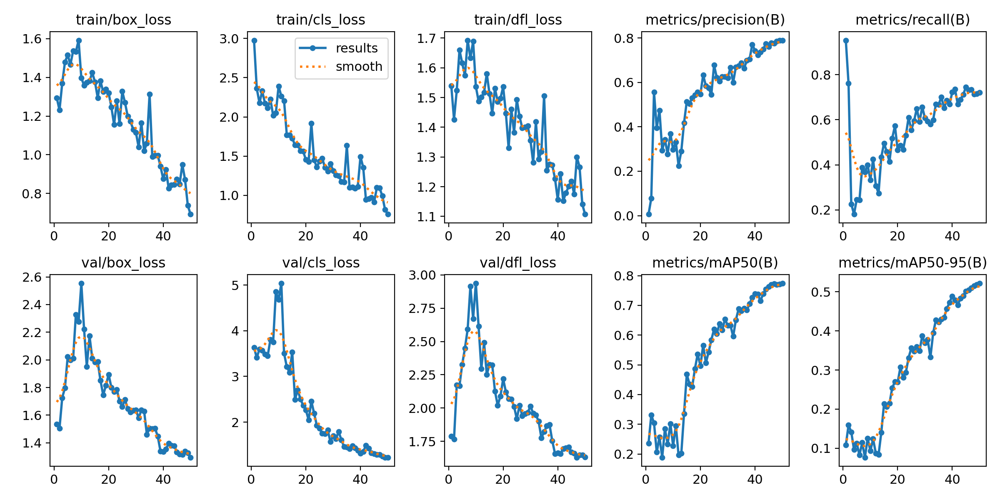
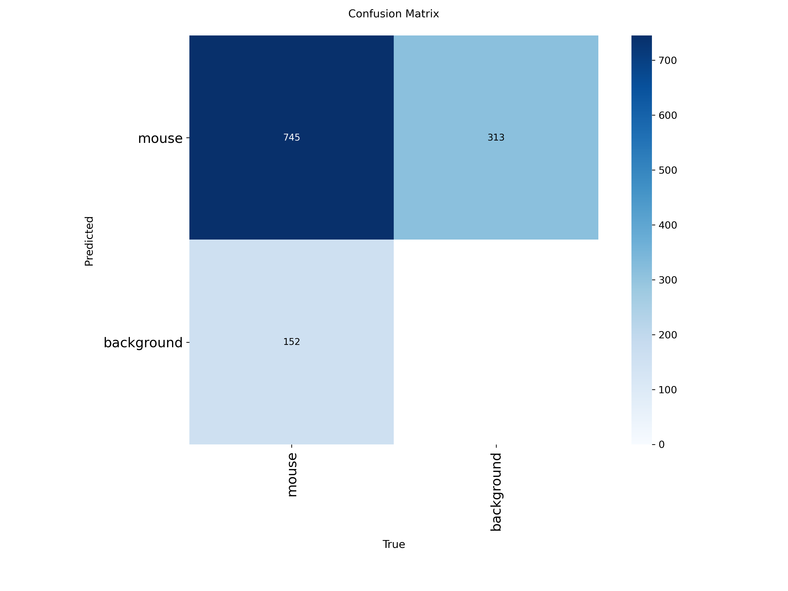

# RodentAI – AI-Powered Rodent Detection System

RodentAI is an AI-powered computer vision system designed to detect rodent movement around parked vehicles and trigger real-time deterrence mechanisms.
Using a custom-trained YOLOv11n model, the system identifies rodents with high accuracy even in low-light and cluttered conditions, helping prevent wire damage, vehicle breakdowns, and safety hazards.

---

## Features

* Real-time rodent detection using YOLOv11n
* Works in low-light parking environments
* High precision and recall (validated with real metrics)
* Lightweight enough to run on laptops and edge devices
* Can trigger ultrasonic deterrent to scare rodents away
* Configurable for garages, parking lots, basements, or car cabins

---

## Model Architecture

RodentAI is built using:

| Component       | Technology                   |
| --------------- | ---------------------------- |
| Detection Model | YOLOv11n                     |
| Framework       | Ultralytics                  |
| Preprocessing   | OpenCV                       |
| Visualization   | Matplotlib                   |
| Training        | Custom dataset (~400 images) |
| Inference       | Python                       |

---

## Model Performance (Real Metrics)

These metrics are from the final training epoch (epoch 50), extracted from the provided `results.csv`.

| Metric    | Score |
| --------- | ----- |
| Precision | 79.0% |
| Recall    | 72.1% |
| mAP@50    | 77.4% |
| mAP@50–95 | 52.1% |

The model performs strongly for a single-class, small-object detection challenge.

---

## Training Curves

The following training and validation metrics were generated automatically by Ultralytics:

* Train/validation box loss
* Train/validation classification loss
* Train/validation DFL loss
* Precision curve
* Recall curve
* mAP50 and mAP50-95 progression



---

## Confusion Matrix

This confusion matrix illustrates detection accuracy versus misclassifications:



Interpretation:

* True Positive (mouse detected correctly): 745
* False Positive: 313
* False Negative: 152

The model achieves an 83% correct identification rate for actual mouse instances.

---

## Dataset Structure

RodentAI uses a YOLO-compatible dataset layout:

```
mouse/
   mouse train/
      images/
      labels/
   Mouse test/
      images/
      labels/
```

YOLO label format:

```
class x_center y_center width height
```

---

## Installation

```bash
git clone https://github.com/swastik2475/rodent-ai
cd rodent-ai
pip install ultralytics opencv-python matplotlib
```

---

## Inference (Run Detection)

Run inference on an image:

```python
from ultralytics import YOLO

model = YOLO("best.pt")
results = model("example.jpg")
results.show()
```

Run on video or webcam:

```python
model("video.mp4", show=True)
```

---

## Validation (Reproduce Metrics)

To validate the model:

```python
from ultralytics import YOLO

model = YOLO("best.pt")
model.val(data="mouse.yaml")
```

---

## File Structure

```
rodent-ai/
│── best.pt                 # Best trained model
│── last.pt                 # Last epoch model
│── mouse.yaml              # Dataset config
│── results.csv             # Training logs
│── RoDet.Ai.ipynb          # Training and inference notebook
│── results.png             # Training curves
│── confusion_matrix.png    # Confusion matrix
│── labels.jpg              # Label distribution
│── README.md               # Project documentation
```

---

## How It Works (Pipeline)

1. Preprocessing

   * Resize
   * Normalize
   * Augment

2. Training

   * YOLOv11n model
   * Custom dataset with 50 epochs

3. Validation

   * mAP calculation
   * Precision and recall evaluation
   * Confusion matrix generation

4. Inference

   * Predict bounding boxes
   * Confidence score filtering

5. Ultrasonic deterrence (optional)

   * Trigger external device when detection occurs

---

## Future Improvements

* Add multi-class detection (rat vs mouse)
* Deploy on Raspberry Pi / Jetson Nano
* Integrate thermal camera support
* Optimize inference for mobile devices
* Add SMS/WhatsApp notification system

---

## Contributing

Contributions are welcome.
For major changes, please open an issue first to discuss your proposed modifications.

---

## Contact

Author: Swastik Sharma
GitHub: [https://github.com/swastik2475](https://github.com/swastik2475)
LinkedIn: [https://www.linkedin.com/in/swastik-sharma-83803928b/](https://www.linkedin.com/in/swastik-sharma-83803928b/)

---
Just tell me what you need.
